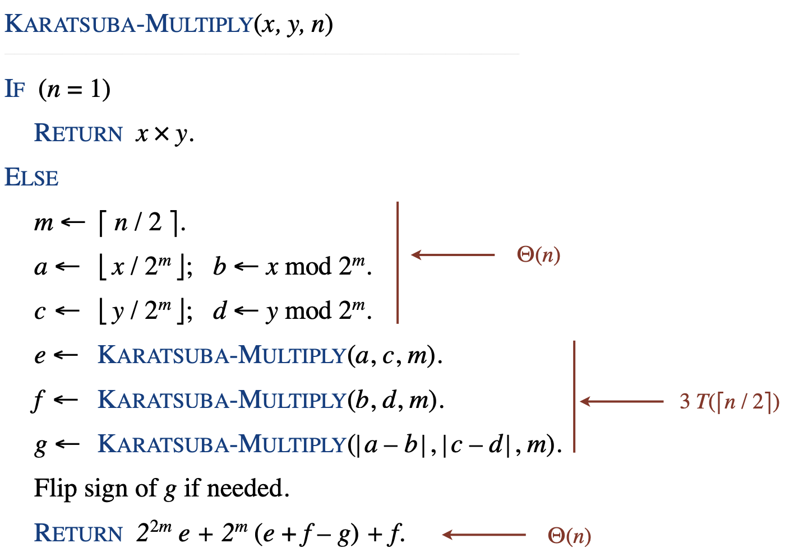

### 分治

分治算法分为三步：划分、解决问题、合并

### 归并排序

时间复杂度为 $O(nlog_2n)$

#### 排序下界定理
- 任何确定性的基于比较的排序算法在最坏情况下必须至少执行 $O(n \log n)$ 次比较。

#### 证明
- **信息论方法**：使用信息论的概念来证明。

1. **假设**：假设数组由 n个不同的值 $a_1$ 到 $ a_n$ 组成。
2. **最坏情况下的比较次数**：在最坏情况下，排序算法需要执行的比较次数等于剪枝比较树的高度 $h$。
3. **比较树的高度**：一个高度为$h$的二叉树最多有$2^h$个叶子。
4. **不同排序的数量**：有 $n!$ 种不同的排序方式，这意味着需要 $n!$ 个可到达的叶子来表示所有可能的排序。
5. **比较次数与排序数量的关系**：由于有 $n!$  种不同的排序，而树的高度 $h$ 决定了最多可以有  $2^h$ 个叶子，因此必须有 $ 2^h \geq n! $
6. **计算下界**：对不等式 $2^h \geq n!$ 取以 2 为底的对数，得到 $ h \geq \log_2(n!) $. 使用斯特林公式近似$\log_2(n!)$，可以得到$ h \geq n \log_2(n) - n$
7. **简化**：由于 $n \log_2(n)$ 是主要项，且 $n$ 够大时其余项相对于  是$O(\log_2(n))$较低阶的项，可以忽略。因此，我们有 $h=O(n \log_2 n)$
8. **结论**：这意味着任何基于比较的排序算法在最坏情况下必须至少进行 $O(n \log n)$ 次比较。

**例题**

给定一个单链表，随机统一的重新排列其节点。假设有完美的随机数生成器，那么时间复杂度为 $n \log n$ ， 空间复杂度为 $\log n$ .

### 逆序对计算

假设数组 $A$ 和 $B$ 为排序之后的子数组，结果数组为 $C$ .

在合并过程中，比较 $A$ 和 $B$ 中的元素，讲较小的元素加到结果数组 $C$ 中：

- 如果 $A[i] \le B[j]$ 
    - $A[i]$ 不会与 $B$ 中任何元素构成逆序对，因为 $A[i]$ 已经是较小的元素。
    - 将 $A[i]$ 添加到 $C$  中，并移动指针 $i$

- **如果 $A[i] > B[j]$**：

    - $A[i]$ 将与 $B$ 中的每个元素 $B[j]$ 及其前面的元素形成反转对，因为 $A[i]$  比这些元素大。

    - 反转对的数量为 $A$ 中剩余元素的数量，即 $mid - i + 1$（其中 $mid$ 是左子数组的结束位置）。

    - 将 $B[j]$ 添加到 $C$ 中，并移动指针 $j$

### 快速排序

给定数组 $a_1, a_2, \dotsm , a_n$ ，在快速排序过程中，$a_1$ 和 $a_n$ 会被比较的概率为 $2/ n$ 

为了证明随机化快速排序的期望比较次数为 \(O(n \log n)\)，我们可以通过分析快速排序过程中比较的概率以及比较的次数来进行证明。

#### 二叉搜索树（BST）表示
在随机化快速排序过程中，我们可以将每次选择的主元（pivot）看作是构建二叉搜索树的节点。排序过程中进行的比较可以理解为在构建二叉搜索树时进行的比较。

#### 比较的发生条件
- 对于任意两个元素 $a_i$ 和 $a_j$（假设 $i < j$），它们会被比较当且仅当其中一个是另一个的祖先。这是因为在快速排序中，主元将数组分为左右两部分，之后的排序是在这些子数组中递归进行的。
- 因此，$a_i$ 和 $a_j$ 会在某一轮排序中被比较的条件是：在它们之间的任一元素没有被选择为主元。

#### 比较的概率
- $a_i$ 和 $a_j$ 之间没有被选择为主元的元素共有 $j - i - 1$个。
- 在随机化快速排序中，每一轮选择主元是等概率的，因此在数组 \([i, j]\) 中选择 \(a_i\) 或 \(a_j\) 作为主元的概率为 \(2 / (j - i + 1)\)。

考虑所有可能的元素对 $(a_i, a_j)$ 的比较。对于每一对 $(a_i, a_j)$ ，其被比较的概率为 $2 / (j - i + 1)$

### Median of medians

快速排序优化版

最坏时间复杂度 $O(n)$ 

在 BFPTR 算法中，仅仅是改变了快速排序中的 *pivot* 值的选取，在快速排序中，我们始终选择第一个元素或者最后一个元素作为 *pivot* ，而在 BFPTR 算法中，每次选择五分中位数的中位数作为 *pivot* ，这样做的目的就是使得划分比较合理，从而避免了最坏情况的发生。算法步骤如下：

1. 将 𝑛 个元素划为 ⌊𝑛/5⌋ 组，每组 5 个，至多只有一组由 $n\ mod\ 5$ 个元素组成。
2. 寻找这 ⌈𝑛/5⌉ 个组中每一个组的中位数，这个过程可以用插入排序。
3. 对步骤2中的 ⌈𝑛/5⌉ 个中位数，重复步骤1和步骤2，递归下去，直到剩下一个数字。
4. 最终剩下的数字即为pivot，把大于它的数全放左边，小于等于它的数全放右边。
5. 判断pivot的位置与k的大小，有选择的对左边或右边递归。

### 最近点对问题

输入 $n$ 个点的集合，输出具有最小欧几里得距离的两个点的对

#### 算法步骤

1. 分解：将点集分为两个子集
2. 递归：独立在两个子集上递归的应用算法
3. 合并：合并两个递归调用的结果，并在两个子集间的点中找到最近点对

### 乘法算法

#### 小学乘法

时间复杂度为 $O(n^2)$ 

#### Karatsuba乘法

时间复杂度为 $O(n^{\log _2 3})$

基本思想：将两个大整数的乘法问题分解为更小整数的乘法问题，从而减少计算量

关键发现：$bc + ad = ac + bd\ –\ (a – b)\ (c – d)$

> $x y = (2^m a + b) (2^m c + d) = 2^{2m} ac + 2^m (bc + ad ) + bd= 2^{2m} ac + 2^m (ac + bd – (a – b)(c – d)) + bd$

**算法步骤**

1. **分解**：将 $x$ 和 $y$ 分解为两个较小的部分，每部分大约是 $n/2$ 位。即：
   - $𝑥=𝑥_1\times 2^{𝑛/2}+𝑥_0$，
   - $y=y_1\times 2^{𝑛/2}+y_0$， 其中  $x_1, x_0, y_1, y_0$ 都是 $n/2$ 位的整数
2. **递归乘法**：计算三个乘积：
   - $𝑃_1=𝑥_1×𝑦_1$
   - $𝑃_2=𝑥_0×𝑦_0$
   - $𝑃_3=(𝑥_1+𝑥_0)×(𝑦_1+𝑦_0)$
3. **合并**：使用以下公式来计算 $x\times y$ ： $𝑥×𝑦=𝑃_1×2^𝑛+(𝑃_3−𝑃_1−𝑃_2)×2^{𝑛/2}+𝑃_2$

### 分块矩阵乘法

