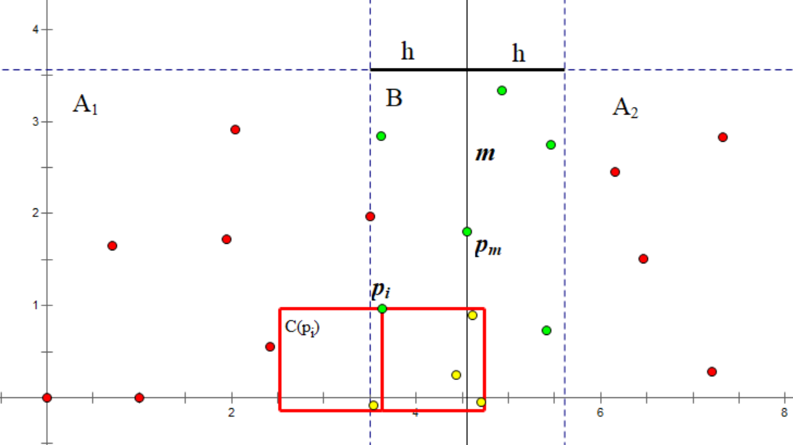
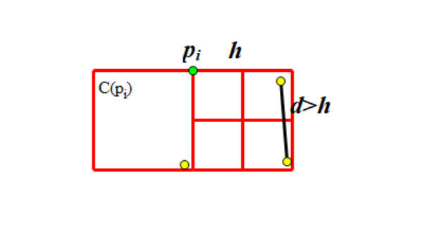

## 平面最近点对

给定 $n$ 个二维平面上的点，求一组欧几里得距离最近的点对。

## 输入

第一行输入点的数量 $n(2 \le n \le 30,000)$. 接下来的n行中，每行包含两个整数 $x$ 和 $y$ $(-1,000,000 \le x, y \le 1,000,000)$，第 $i$ 行包含第 $i$ 个点的坐标。

## 输出

输出一个浮点数 $d$ ，表示最近的一对点之间的距离。 

$d$ 应该精确到小数点后 6 位。

## 解题思路

这个题目主要使用的是分治法。

参考了 [https://oi-wiki.org/geometry/nearest-points/]() 的题解。

我们将这个有 $n$ 个点的集合拆分成两个大小相同的集合 $S_1, S_2$，并不断递归下去。

我们先将所有点按照 $x_i$ 为第一关键字、$y_i$ 为第二关键字排序，并以点 
 
$p_m (m = \lfloor \frac{n}{2} \rfloor)$ 为分界点，拆分点集为 $A_1,A_2$：
 
$\begin{aligned}
A_1 &= \{p_i \ \big | \ i = 0 \dotsm m \}\\
A_2 &= \{p_i \ \big | \ i = m + 1 \dotsm n-1 \}
\end{aligned}$

并递归下去，求出两点集各自内部的最近点对，设距离为 $dist_1,dist_2$ ，取较小值设为 $min\_dist$.

我们试图找到这样的一组点对，其中一个属于 $A_1$ ，另一个属于 $A_2$ ，且二者距离小于 $min\_dist$ 。因此我们将所有横坐标与 $x_m$ 的差小于 $min\_dist$ 的点放入集合 $B$：

$B = \{ p_i \ \big | \ \lvert x_i - x_m \rvert < h \}$

结合图像，直线 $x=m$ 将点分成了两部分。

$m$ 左侧为 $A_1$ 点集，右侧为为 $A_2$ 点集。

再根据 $B = \{ p_i \ \big | \ \lvert x_i - x_m \rvert < h \}$ 规则，得到绿色点组成的 $B$ 点集。


对于 B 中的每个点 $p_i$ ，我们当前目标是找到一个同样在 B 中、且到其距离小于 $h$ 的点。

为了避免两个点之间互相考虑，我们只考虑那些纵坐标小于 $y_i$ 的点。显然对于一个合法的点 $p_j$ ，$y_i - y_j$ 必须小于 $h$。

于是我们获得了一个集合 $C(p_i)$ ：

$C(p_i) = \{ p_j\ \big |\ p_j \in B,\ y_i - h < y_j \le y_i \}$

在点集 B 中选一点 $p_i$ ，根据 
$C(p_i) = \{ p_j\ \big |\ p_j \in B,\ y_i - h < y_j \le y_i \}$ 的规则，得到了由红色方框内的黄色点组成的 C 点集。



合并的步骤：

- 构建集合 $B$
- 将 $B$ 中的点按照 $y_i$ 排序。通常做法是 $O(n\log n)$ ，但是我们可以改变策略优化到 $O(n)$（下文讲解）
- 对于每个 $p_i \in B$ 考虑 $p_j \in C(p_i)$ ，对于每对 $(p_i,p_j)$ 计算距离并更新答案（当前所处集合的最近点对）

**复杂度证明**

我们已经了解到，$C(p_i)$ 中的所有点的纵坐标都在 $(y_i-h,y_i]$ 范围内；且 $C(p_i)$ 中的所有点，和 $p_i$ 本身，横坐标都在 $(x_m-h,x_m+h)$ 范围内。

这构成了一个 $2h \times h$ 的矩形。

我们再将这个矩形拆分为两个 $h \times h$ 的正方形，不考虑 $p_i$ ，其中一个正方形中的点为 $C(p_i) \cap A_1$ ，另一个为 $C(p_i) \cap A_2$ ，且两个正方形内的任意两点间距离大于 $h$ 。（因为它们来自同一层递归）

我们将一个 $h \times h$ 的正方形拆分为四个 $\frac{h}{2} \times \frac{h}{2}$ 的小正方形。

可以发现，每个小正方形中最多有 1 个点：因为该小正方形中任意两点最大距离是对角线的长度，即  $\frac{h}{\sqrt 2}$ ，该数小于 $h$ 



由此，每个正方形中最多有 4 个点，矩形中最多有 8 个点，去掉 $p_i$ 本身，$\max(C(p_i))=7$

```cpp
#include <iostream>
#include <algorithm>
#include <cmath>
#include <limits>
using namespace std;

// const int N = 30010;

struct Point
{
    double x, y; // 坐标
};

bool compare_points_x(const Point &a, const Point &b) {
    return a.x < b.x; // 从小到大排序
}

bool compare_points_y(const Point &a, const Point &b) {
    return a.y < b.y; // 从小到大排序
}

double compute_distance(const Point &a, const Point &b) {
    return sqrt((a.x - b.x) * (a.x - b.x) + (a.y - b.y) * (a.y - b.y));
}

double divide(Point points[], int left, int right) {
    if (left == right) {
        return numeric_limits<int>::max();
    }
    if (left + 1 == right) {
        return compute_distance(points[left], points[right]);
    }
    
    int mid = (left + right) >> 1;
    double dist1 = divide(points, left, mid);
    double dist2 = divide(points, mid + 1, right);
    double min_dist = min(dist1, dist2);
    
    int temp_size = right - left + 1;
    Point mid_points[temp_size];
    int index = 0;
    for (int i = left; i <= right ; i++) {
        if ( abs(points[i].x - points[mid].x) < min_dist ) {
            mid_points[index++] = points[i]; // 求出位于中间地带的点
        }
    }
    sort(mid_points, mid_points + index, compare_points_y);
    
    for (int i = 0; i < index; i++) {
        for (int j = i + 1; j < index && j < i + 6; j++) {
            if ((mid_points[j].y - mid_points[i].y) > min_dist) {
                 // 如果两个点的纵坐标之差大于当前最小值，则一定不符合条件，直接进行下一组判断即可
                break;
            }
            double current_dist = compute_distance(mid_points[i], mid_points[j]);
            if (current_dist <= min_dist) {
                // 如果当前点距离小于等于当前最小值，则对最小距离进行更新
                min_dist = current_dist;
            }
        }
    }
    return min_dist;
}

int main()
{
    int n;
    scanf("%d", &n);
    Point points[n];
    for (int i = 0; i < n; i++) {
        scanf("%le%le", &points[i].x, &points[i].y);
    }
    // 按照横坐标进行从小到大的排序
    sort(points, points + n, compare_points_x);
    
    printf("%.6f", divide(points, 0, n - 1));
    
    return 0;
}
```
