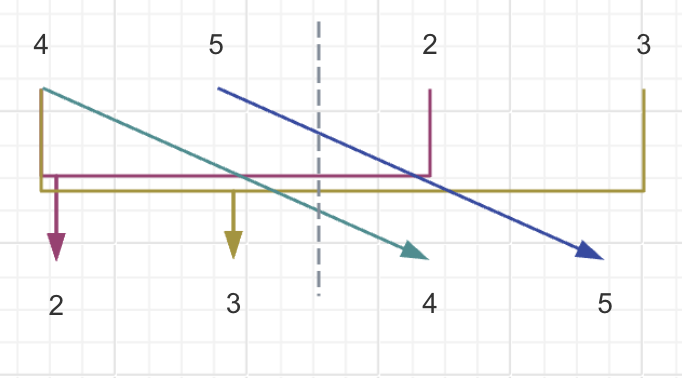

## 逆序对的数量

给定一个长度为 $n$ 的整数数列，请你计算数列中的逆序对的数量。

逆序对的定义如下：对于数列的第 $i$ 个和第 $j$ 个元素，如果满足 $i<j$ 且 $a[i]>a[j]$ ，则其为一个逆序对；否则不是。

## 输入格式

第一行包含整数 $n$ ，表示数列的长度。

第二行包含 $n$ 个整数，表示整个数列。

## 输出格式

输出一个整数，表示逆序对的个数。

数据范围
$1\le n\le 100000$

数列中的元素的取值范围 [1,109]

## 输入样例

```
6
2 3 4 5 6 1
```

## 输出样例

```
5
```

## 解题思路

这个题目可以用归并排序的思路来做，因为归并排序就是比较数组中每一个元素的大小，在这个比较的过程中我们就可以进行逆序对的计算。



对于右侧的数字来说，它超过的比它数值大的数字就是左边的剩下的数字数目，也就是 $mid - p + 1$.

其中 $p$ 也就是左侧指针所在的位置。

```cpp
#include<iostream>
using namespace std;

const int N = 100010;
int a[N], temp[N];
long int sum = 0;

void merge_sort(int left, int right)
{
    if (left >= right) {
        return;
    }
    int mid = left + right >> 1;
    merge_sort(left, mid);
    merge_sort(mid + 1, right);
    int p = left, q = mid + 1, index = 0;
    while (p <= mid && q <= right){
        if (a[p] > a[q]) {
            temp[index++] = a[q++];
            sum += mid - p + 1;
        } else {
            temp[index++] = a[p++];
        }
    }
    while (p <= mid) {
        temp[index++] = a[p++];
    }
    while (q <= right) {
        temp[index++] = a[q++];
    }
    for (int i = left, j = 0; i <= right; i++, j++) {
        a[i] = temp[j];
    }
}

int main()
{
    int n;
    scanf("%d", &n);
    
    for (int i = 0; i < n; i++) {
        scanf("%d", &a[i]);
    }
    merge_sort(0, n - 1);
    printf("%ld\n", sum);
    return 0;
}
```