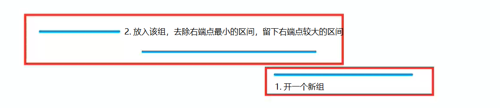

## 区间分组
给定 $N$ 个闭区间 [ $a_i, b_i$ ]，请你将这些区间分成若干组，使得每组内部的区间两两之间（包括端点）没有交集，并使得组数尽可能小。

输出最小组数。

## 输入格式
第一行包含整数 $N$ ，表示区间数。

接下来 $N$ 行，每行包含两个整数 $a_i, b_i$ ，表示一个区间的两个端点。

## 输出格式
输出一个整数，表示最小组数。

## 数据范围
$1≤N≤10^5,−10^9≤a_i≤b_i≤10^9$

**输入样例**
```r
3
-1  1
2   4
3   5
```
**输出样例**
```
2
```

## 解题思路
### 贪心算法
- 先按照区间的右端点，从小到大对区间进行排序。
- 从前往后枚举每个区间，判断这个区间能否放到现有的区间分组中。
    - 如果一个区间的左端点比最小组的右端点要小，就开一个新的分组；
    - 如果一个区间的左端点比最小组的右端点大，就把这个区间放到现有分组里，并修改现有分组的右端点。
  


```cpp
#include <iostream>
#include <algorithm>
#include <queue>
#include <cstdio>

using namespace std;

const int N = 100010;

int n;
struct Range
{
    int l, r;
    bool operator< (const Range &W)const
    {
        return l < W.l;
    }
}range[N];

int main()
{
    scanf("%d", &n);
    for (int i = 0; i < n; i ++ )
    {
        int l, r;
        scanf("%d%d", &l, &r);
        range[i] = {l, r};
    }

    sort(range, range + n);

    priority_queue<int, vector<int>, greater<int>> heap;
    for (int i = 0; i < n; i ++ )
    {

        if (heap.empty() || heap.top() >= range[i].l){
            heap.push(range[i].r); // 开一个新组
        }
        else {
            heap.pop(); 
            heap.push(range[i].r);
        }
    }

    printf("%d\n", heap.size());

    return 0;
}


```

### 转换为活动安排问题
给定 $N$ 个活动，时间为[ $a_i, b_i$ ]，请问最少需要几个教室就可以顺利确保活动的正常举行。

这种情况下，一个活动结束后，另一个活动就可以在它所在的教室里举行。

我们可以把所有开始时间和结束时间排序，遇到开始时间就把需要的教室加1，遇到结束时间就把需要的教室减1,在一系列需要的教室个数变化的过程中，峰值就是多同时进行的活动数，也是我们至少需要的教室数。

```cpp
#include <iostream>
#include <algorithm>

using namespace std;

const int N = 100100;

int n;
int b[2 * N], idx;

int main()
{
    scanf ("%d", &n);
    for(int i = 0; i < n; i ++)
    {
        int l, r;
        scanf("%d %d", &l, &r);
        b[idx ++] = l * 2;//标记左端点为偶数。
        b[idx ++] = r * 2 + 1;// 标记右端点为奇数。
    }

    sort(b, b + idx); // 排序

    int res = 1, t = 0;
    for(int i = 0; i < idx; i ++)
    {
        if(b[i] % 2 == 0) t ++; // 左端点，教室+1
        else t --; // 右端点，教室-1
        res = max(res, t);
    }
    printf ("%d\n", res);
    return 0;
}
```