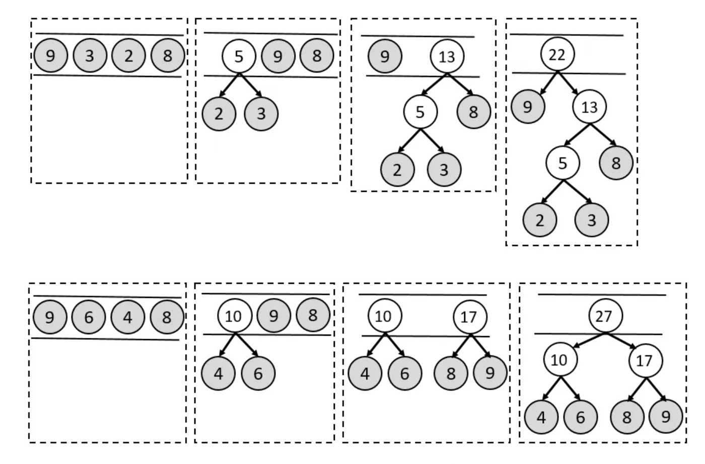

## 哈夫曼树/最优二叉树
### 构造原则

权值越大离根节点越近，权值越小离根节点越远

### 构造步骤
**贪心算法**,时间复杂度为 $O(n·logn)$
1. 用给定的 $n$ 个权值创建 $n$ 棵只有一个节点的树，将它们添加到集合 $S$ 中
2. 每次取出集合中权值最小的两个点 $a$ 和 $b$ ，将它们作为叶子结点， $a+b$ 作为根节点，组成一棵新的二叉树，并将这个树添加到集合 $S$ 中
3. 重复步骤2，直至集合中只有一棵树

### 性质

- 哈夫曼树是 $n$个节点组成的树中，加权路径长度最小的树。
- 只有度为 0 和 2 的节点，没有度为 1 的节点，也就是说哈夫曼树中每个节点要么没有子节点，要么有两个子节点，不可能只有一个子节点。
- 一棵有 $n$ 个叶子节点的哈夫曼树总共有 $2^{n-1}$ 个节点。每次从集合中取出权值最小的两棵树，可以使用最小堆。